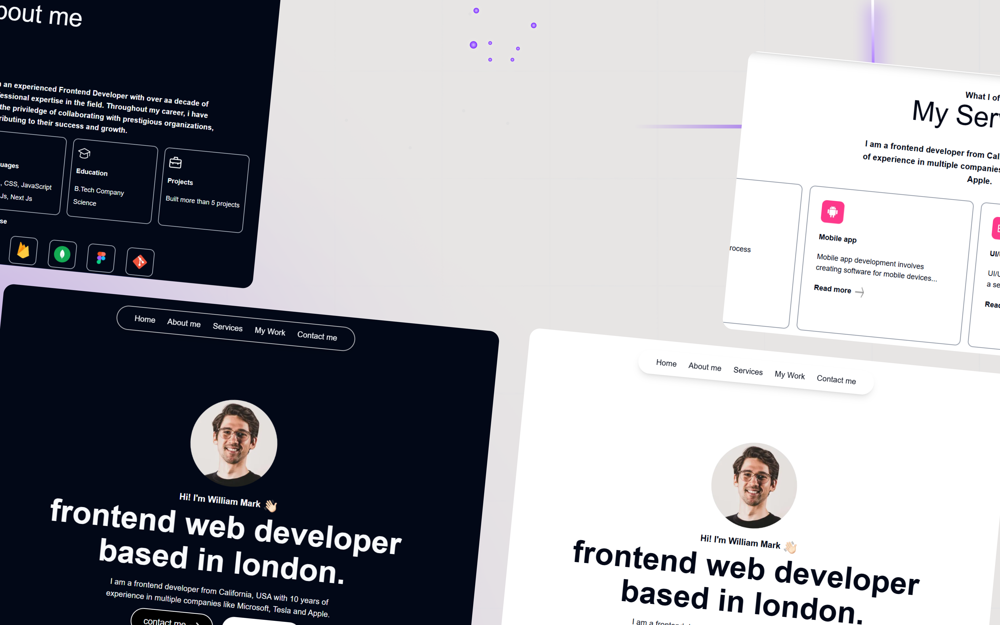

# WillDev - Modern Developer Portfolio | Next.js + Tailwind

[](https://willdev-olive.vercel.app)
[](https://github.com/KMV531/willdev)

✨ **A sleek, animated portfolio template** built with cutting-edge frontend technologies. Perfect for developers who want to showcase their work with style.

## Key Features

- **Micro-Interactions**: Smooth animations with Framer Motion
- **Dark/Light Mode**: Theme toggle with system preference detection
- **Mobile-First**: Fully responsive design
- **Modern Stack**: Next.js 14 + Tailwind CSS
- **UI Components**: Built with shadcn/ui for consistency

## Tech Stack

| Technology       | Purpose                          |
|------------------|----------------------------------|
| Next.js 14       | Framework & SSR                  |
| Tailwind CSS     | Utility-first styling            |
| Framer Motion    | Advanced animations              |
| shadcn/ui        | Accessible UI components         |
| Vercel           | Hosting & deployment             |

## Design Highlights



- **Performance**: 95+ Lighthouse score
- **Accessibility**: WCAG 2.1 compliant
- **SEO Optimized**: Next.js built-in features


## Why This Stands Out

This isn't just another portfolio template:

- **Custom animations that don't sacrifice performance**

- **Production-ready with TypeScript support**

- **Easy to customize for client projects**

## Available for Work

I'm KMV Dev, a web developer specializing in:

- **High-performance websites**

- **Animated user interfaces**

- **Responsive design systems**

Contact: koladjamomo@gmail.com <br /> <br />
More Work: http://kmvdev.vercel.app

## Local Development

1. Clone repository:
   ```bash
   git clone https://github.com/KMV531/willdev.git
   
2. Install dependencies:
   ```bash
   npm install

3. Run development server:
   ```bash
   npm run dev
